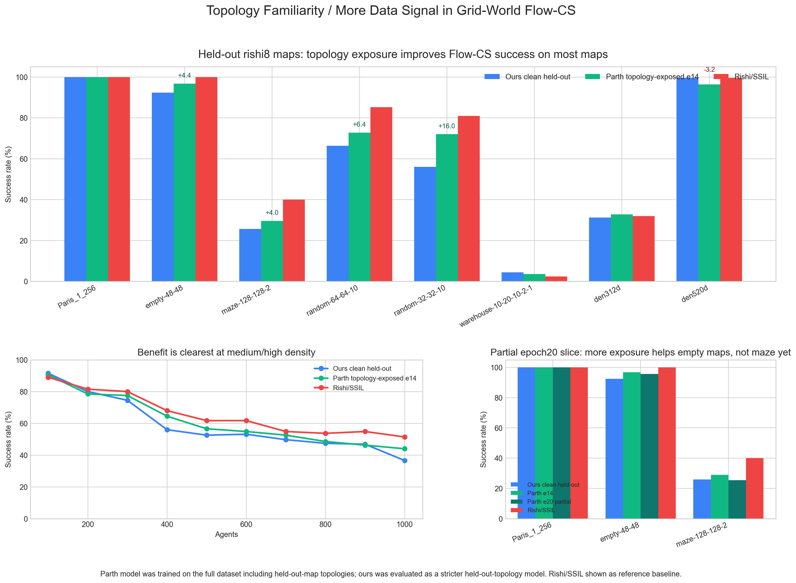

# Topology Exposure Evidence

Parth wave2 FT v2 epoch14 was trained with the full dataset, including the held-out map topologies. Our wave10 model is the stricter held-out-topology model. This table compares both on the same rishi8 evaluation keys.

## Overall

| Model | Rows | Success | Delta vs ours |
| --- | ---: | ---: | ---: |
| Ours clean held-out | 1850 | 59.73% | +0.00 pp |
| Parth topology-exposed e14 | 1850 | 62.27% | +2.54 pp |
| Rishi/SSIL reference | 1850 | 66.43% | +6.70 pp |

## Per Map

| Map | Runs | Ours | Parth e14 | Delta | Rishi/SSIL | Parth wins over ours | Ours wins over Parth |
| --- | ---: | ---: | ---: | ---: | ---: | ---: | ---: |
| Paris_1_256 | 250 | 100.00% | 100.00% | +0.00 pp | 100.00% | 0 | 0 |
| empty-48-48 | 250 | 92.40% | 96.80% | +4.40 pp | 100.00% | 14 | 3 |
| maze-128-128-2 | 250 | 25.60% | 29.60% | +4.00 pp | 40.00% | 13 | 3 |
| random-64-64-10 | 250 | 66.40% | 72.80% | +6.40 pp | 85.20% | 38 | 22 |
| random-32-32-10 | 100 | 56.00% | 72.00% | +16.00 pp | 81.00% | 22 | 6 |
| warehouse-10-20-10-2-1 | 250 | 4.40% | 3.60% | -0.80 pp | 2.40% | 3 | 5 |
| den312d | 250 | 31.20% | 32.80% | +1.60 pp | 32.00% | 14 | 10 |
| den520d | 250 | 99.60% | 96.40% | -3.20 pp | 99.60% | 0 | 8 |

## By Agent Count

| Agents | Runs | Ours | Parth e14 | Delta | Rishi/SSIL |
| ---: | ---: | ---: | ---: | ---: | ---: |
| 100 | 200 | 91.50% | 90.50% | -1.00 pp | 89.00% |
| 200 | 200 | 80.00% | 78.50% | -1.50 pp | 81.50% |
| 300 | 200 | 74.50% | 77.50% | +3.00 pp | 80.00% |
| 400 | 200 | 56.00% | 64.50% | +8.50 pp | 68.00% |
| 500 | 175 | 52.57% | 56.57% | +4.00 pp | 61.71% |
| 600 | 175 | 53.14% | 54.86% | +1.71 pp | 61.71% |
| 700 | 175 | 49.71% | 52.57% | +2.86 pp | 54.86% |
| 800 | 175 | 47.43% | 48.57% | +1.14 pp | 53.71% |
| 900 | 175 | 46.86% | 46.29% | -0.57 pp | 54.86% |
| 1000 | 175 | 36.57% | 44.00% | +7.43 pp | 51.43% |

## Partial Epoch20 Slice

The partial epoch20 file has 697 overlapping rows across Paris_1_256, empty-48-48, and part of maze-128-128-2. Treat this as directional only.

| Map | Runs | Ours | Parth e14 | Parth e20 partial | Rishi/SSIL | e20 delta vs ours |
| --- | ---: | ---: | ---: | ---: | ---: | ---: |
| Paris_1_256 | 250 | 100.00% | 100.00% | 100.00% | 100.00% | +0.00 pp |
| empty-48-48 | 250 | 92.40% | 96.80% | 95.60% | 100.00% | +3.20 pp |
| maze-128-128-2 | 197 | 25.89% | 28.93% | 25.38% | 40.10% | -0.51 pp |

## Takeaway

- On the full rishi8 panel, topology exposure/full-data training improves Parth e14 over ours by +2.54 pp overall: 62.27% vs 59.73%.
- The gain is concentrated on random-32-32-10 (+16.00 pp), random-64-64-10 (+6.40 pp), empty-48-48 (+4.40 pp), and maze-128-128-2 (+4.00 pp).
- The density curve suggests the benefit is most visible around 400 agents (+8.50 pp) and 1000 agents (+7.43 pp).
- Caveat: this is not a pure generalization comparison, because Parth sees held-out topologies during training. That is exactly the point of this exhibit: familiar topology plus broader data helps performance.
