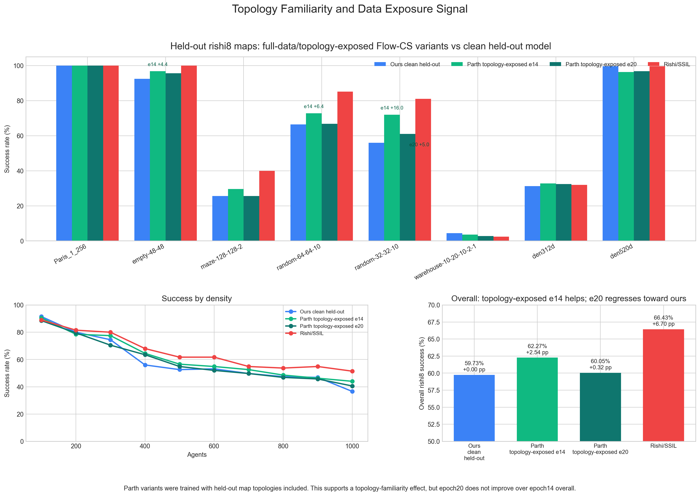

# Topology Exposure Evidence With Parth Epoch20

This compares the clean held-out Flow-CS model against Parth variants trained on the full dataset, including held-out map topologies. The new Parth epoch20 CSV is complete for rishi8.

## Overall

| Model | Rows | Success | Delta vs ours |
| --- | ---: | ---: | ---: |
| Ours clean held-out | 1850 | 59.73% | +0.00 pp |
| Parth topology-exposed e14 | 1850 | 62.27% | +2.54 pp |
| Parth topology-exposed e20 | 1850 | 60.05% | +0.32 pp |
| Rishi/SSIL | 1850 | 66.43% | +6.70 pp |

## Per Map

| Map | Runs | Ours | Parth e14 | e14 delta | Parth e20 | e20 delta | Rishi/SSIL |
| --- | ---: | ---: | ---: | ---: | ---: | ---: | ---: |
| Paris_1_256 | 250 | 100.00% | 100.00% | +0.00 pp | 100.00% | +0.00 pp | 100.00% |
| empty-48-48 | 250 | 92.40% | 96.80% | +4.40 pp | 95.60% | +3.20 pp | 100.00% |
| maze-128-128-2 | 250 | 25.60% | 29.60% | +4.00 pp | 25.60% | +0.00 pp | 40.00% |
| random-64-64-10 | 250 | 66.40% | 72.80% | +6.40 pp | 66.80% | +0.40 pp | 85.20% |
| random-32-32-10 | 100 | 56.00% | 72.00% | +16.00 pp | 61.00% | +5.00 pp | 81.00% |
| warehouse-10-20-10-2-1 | 250 | 4.40% | 3.60% | -0.80 pp | 2.80% | -1.60 pp | 2.40% |
| den312d | 250 | 31.20% | 32.80% | +1.60 pp | 32.40% | +1.20 pp | 32.00% |
| den520d | 250 | 99.60% | 96.40% | -3.20 pp | 96.80% | -2.80 pp | 99.60% |

## By Agent Count

| Agents | Runs | Ours | Parth e14 | e14 delta | Parth e20 | e20 delta | Rishi/SSIL |
| ---: | ---: | ---: | ---: | ---: | ---: | ---: | ---: |
| 100 | 200 | 91.50% | 90.50% | -1.00 pp | 88.50% | -3.00 pp | 89.00% |
| 200 | 200 | 80.00% | 78.50% | -1.50 pp | 79.50% | -0.50 pp | 81.50% |
| 300 | 200 | 74.50% | 77.50% | +3.00 pp | 70.50% | -4.00 pp | 80.00% |
| 400 | 200 | 56.00% | 64.50% | +8.50 pp | 63.50% | +7.50 pp | 68.00% |
| 500 | 175 | 52.57% | 56.57% | +4.00 pp | 54.86% | +2.29 pp | 61.71% |
| 600 | 175 | 53.14% | 54.86% | +1.71 pp | 52.00% | -1.14 pp | 61.71% |
| 700 | 175 | 49.71% | 52.57% | +2.86 pp | 49.71% | +0.00 pp | 54.86% |
| 800 | 175 | 47.43% | 48.57% | +1.14 pp | 46.86% | -0.57 pp | 53.71% |
| 900 | 175 | 46.86% | 46.29% | -0.57 pp | 45.71% | -1.14 pp | 54.86% |
| 1000 | 175 | 36.57% | 44.00% | +7.43 pp | 40.57% | +4.00 pp | 51.43% |

## Takeaway

- Parth e14 is the strongest topology-exposure evidence: +2.54 pp over ours overall on the same 1850 rishi8 runs.
- The gains are concentrated on random-32-32-10, random-64-64-10, empty-48-48, and maze-128-128-2.
- Parth e20 is complete now, but it is only +0.32 pp over ours overall and below e14, so it weakens a simple “later epoch is better” story.
- The cleaner claim is: exposing held-out topologies/full-data training can improve Flow-CS performance, but more training is not monotonically better without checkpoint selection.
